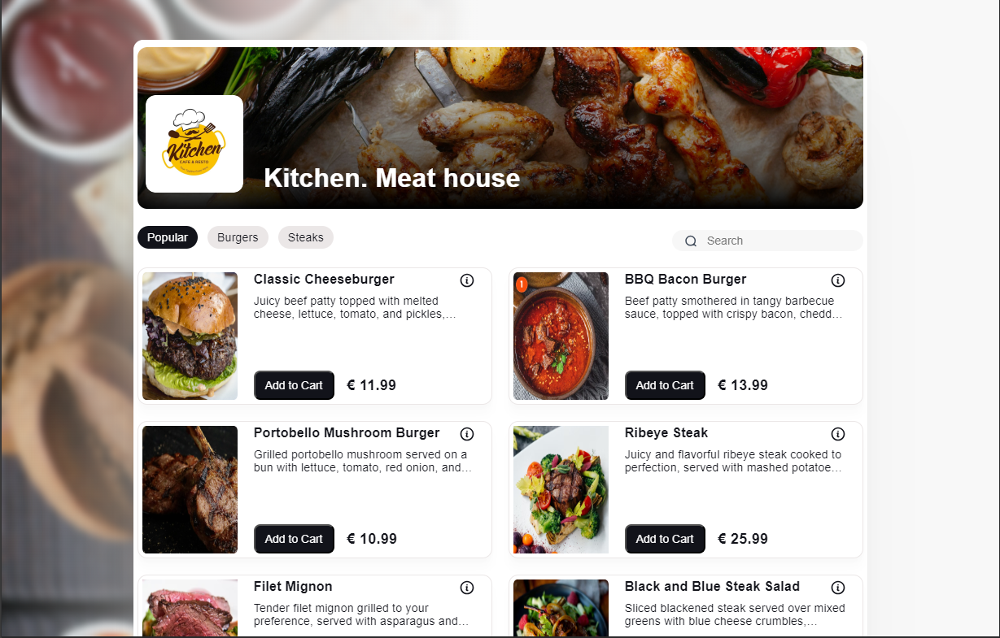
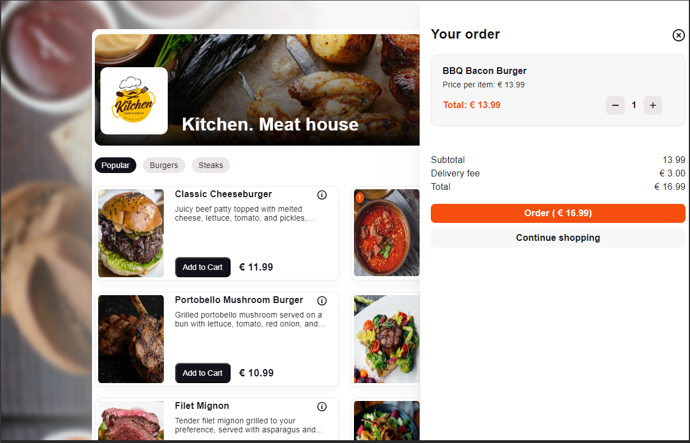
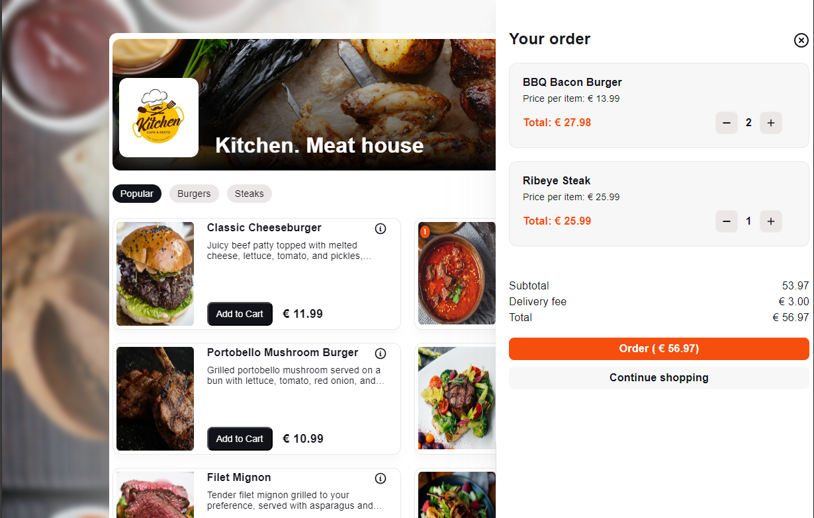
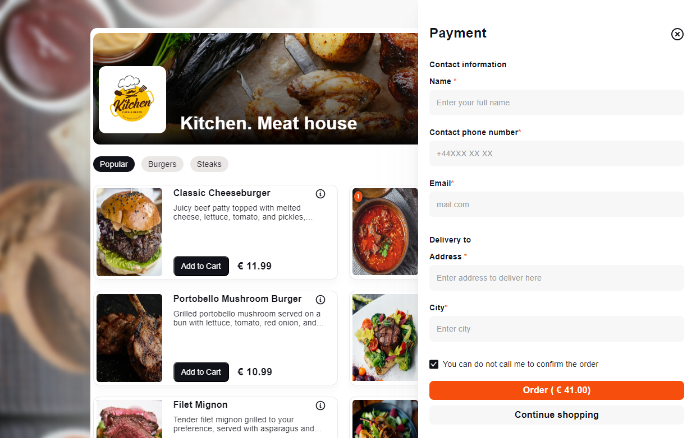

# Angular Restaurant Ordering App

Welcome to the Angular Restaurant Ordering App!

## Setup

To set up the REST server for this assignment, you will need to install `json-server` using npm. Follow these steps:

1. Navigate to the provided folder in the assignment directory using your terminal or command prompt.
2. Run the command `npm install -g json-server` to install `json-server` globally on your system.
3. Serve the provided folder as the data source for the server by running the command `json-server restaurantapp.json`.

For more information about `json-server`, refer to [json-server documentation](https://github.com/typicode/json-server).

## REST Server Endpoints

The REST server provides the following endpoints:

- **GET /dishes:** Returns a list of all dishes available in the restaurant.
- **GET /dishes/:id:** Retrieves a specific dish by its unique identifier.
- **GET /basket:** Returns the current contents of the user's shopping basket.
- **POST /basket:** Allows adding items to the user's shopping basket.

## Design

The design for the menu overview, shopping basket, and checkout components can be found [here](https://www.figma.com/file/CgRnGLpUSq12X5LyH64txc/test-task-for-front-end-developer?type=design&mode=design).

## Objective

The objectives of this assignment include:

- Creating a menu overview according to the provided visual and interaction designs.
- Allowing users to select an item and quantity.
- Creating a shopping basket according to the provided visual and interaction designs.
- Allowing users to add items from the menu to their basket.
- Allowing users to see an overview of their basket.
- Allowing users to modify their basket.

Additionally, the menu functionality includes:

- **Search Dishes:** Users can search for dishes based on their name.
- **Filter by Category:** Users can filter dishes based on categories such as popular, burgers, or steaks.

## Components

This project includes the following components:

- **Menu Overview:** Displays the menu items available for ordering. Allows users to select items and specify quantities. Provides functionality for searching and filtering dishes.
- **Basket:** Shows the current contents of the user's shopping basket. Allows users to add, remove, or modify items in the basket.
- **Checkout:** In preparation for future functionality, a form has been created to facilitate the checkout process. This form will collect and submit the necessary details for completing an order. Additionally, visual elements have been incorporated to ensure a seamless user experience during the checkout process.

## Service: Restaurant

The `restaurant` service contains the logic for interacting with the REST API to fetch menu items, manage the shopping basket, perform search and filter operations, and handle checkout functionality.

### Features and Functionality:

1. **Fetching Menu Items:**

- The `restaurant` service facilitates the retrieval of menu items from the backend server, enabling users to browse the available dishes for ordering.

2. **Managing Shopping Basket:**

- Users can add items to their shopping basket, view the current contents of the basket, and modify the quantity of items.
- The service efficiently tracks basket items and calculates the total price, providing users with a seamless shopping experience.

3. **Search and Filter Operations:**

- Users can easily search for dishes by their name and filter them based on categories such as popular, burgers, or steaks.
- The service handles the logic for filtering and searching through the menu items, ensuring users can quickly find their desired dishes.

4. **Checkout Preparation:**

- While not fully implemented in this assignment, the `restaurant` service lays the groundwork for future checkout functionality.
- It includes the creation of a form to collect and submit order details, visually preparing for a smooth user experience during the checkout process.

---

